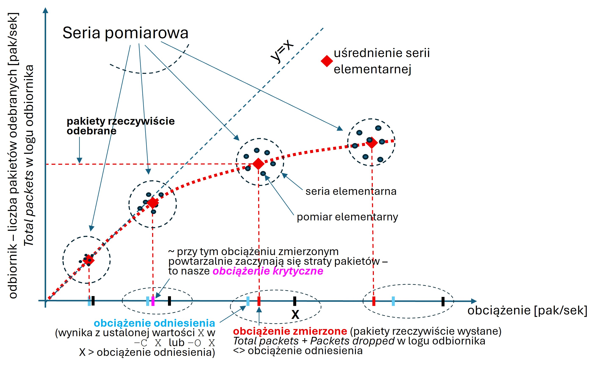

# Pakietowy ruch samopodobny

## Co tutaj mamy

Repozytorium zawiera opis ćwiczenia laboratoryjnego, podczas którego demonstrujemy wpływ zmienności strumienia pakietów (dokładniej, chwilowych stochastycznych zmian intensywności napływu pakietów) obciążającego interfejs przełącznika na opóźnienie i straty pakietów na tym interfejsie. Celem ćwiczenia jest ugruntowanie wykładowej wiedzy dotyczącej zjawisk ruchowych zachodzących w sieciach pakietowych, a przy okazji zapoznanie się z przykładowymi narzędziami pomocnymi w analizie tych zjawisk. Ma ono charakter metrologiczny i jest realizowane w środowisku wrażliwym wydajnościowo. Dlatego jego przeprowadzenie wymaga uważnego **zapoznania się z instrukcją i plikiem `lbr.sh` oraz dobrego zrozumienia przedstawionej tu koncepcji pomiarowej**.

> :memo: **Wyjaśnienie**: W podstawowej wersji laboratorium nie generujemy ruchu samopodobnego (self-similar czy long-range dependent) w ścisłym rozumieniu, a jedynie ruch ON/OFF o współczynniku wariancji większym od 1. Zainteresowani użytkownicy mogą jednak w ramach prac własnych samodzielnie skonfigurować stronę nadawczą narzędzia D-ITG w celu emulowania strumieni bardziej zbliżonych do samopodobnych. W tym celu można użyć np. rozkładu Weibull'a w celu generowania czasu trwania stanów ON/OFF dla binarnych źródeł ruchu czy czasu między kolejnymi pakietami w stanie aktywnym źródła.

## Spis treści

1. [Środowisko laboratoryjne](#środowisko-laboratoryjne)
   1. [Sieć](#sieć)
   2. [Warianty wdrożeniowe](#warianty-wdrożeniowe)
   3. [Artefakty](#artefakty)
2. [Ogólna forma ćwiczenia](#ogólna-forma-ćwiczenia)
3. [Pomiar elementarny](#pomiar-elementarny-przebieg)
   1. [Sekwencja działań](#sekwencja-działań)
   2. [Parametryzacja strumienia ruchu (w ramach elementarnego pomiaru)](#parametryzacja-strumienia-ruchu-w-ramach-elementarnego-pomiaru)
      1. [Podstawowe strumienie ruchu i przykłady użycia](#podstawowe-strumienie-ruchu-i-przykłady-użycia)
      2. [Przypadek złożony: ruch ON/OFF](#przypadek-złożony-ruch-onoff)
      3. [Inne uwagi, przyomnienia](#inne-uwagi-przypomnienia)
4. [Opis zadań do wykonania](#opis-zadań-do-wykonania)
   1. [Ustalenie właściwego punktu pracy sieci](#ustalenie-właściwego-punktu-pracy-sieci)
   2. [Ćwiczenie właściwe](#ćwiczenie-właściwe)
      1. [Struktura: serie pomiarowe, serie elementarne, pomiary elementarne](#struktura-serie-pomiarowe-serie-elementarne-pomiary-elementarne)
      2. [Parametry: ustawienia](#parametry-ustawienia)
      3. [Procedura](#procedura)
   4. [Raport: postać wyników i wnioski](#raport-postać-wyników-i-wnioski)
5. [DODATEK: optymalizacja wydajnościowa pomiarów](#dodatek-optymalizacja-wydajnościowa-pomiarów)
   1. [Maszyna goszcząca i maszyna wirtualna](#maszyna-goszcząca-i-maszyna-wirtualna)
   2. [Moduł odbiorczy ITGRecv](#moduł-odbiorczy-itgrecv)
   3. [Moduł nadawczy ITGSend](#moduł-nadawczy-itgsend)

# Środowisko laboratoryjne

  ## Sieć

W zamyśle ćwiczenie ma zilustrować **istotę** wpływu, jaki charakterystyka ruchu pakietowego (płynny, losowy, wybuchowy/samopodobny) wywiera na metryki transferu pakietów (strata, opóźnienie, etc.). Z założenia ćwiczenie powinno też być niskobudżetowe - realizowane z użyciem sprzętu obliczeniowego powszechnego użytku. Dlatego "ilościowo-zasobowa" konfiguracja naszego środowiska (w szczególności rozmiar bufora w obserwowanym interfejsie przełącznika sieciowego) znacznie odbiega od tego, co moglibyśmy zobaczyć w urządzeniach rzeczywistej sieci. Ważne jest jednak, że pomimo narzuconych przez środowisko ograniczeń i przyjętych przez nas uproszczeń główny cel ćwiczenia nadal z powodzeniem daje się osiągnąć.

Posługujemy się modelem prostej sieci emulowanej przez parę sieciowych przestrzeni nazw (ang. _newtork namespace_) reprezentujących terminale końcowe (hosty), które są dołączone do przełącznika realizowanego przez urządzenie typu _linux bridge_. Przełącznik ten modeluje ruter przenoszący ruch pakietowy pomiędzy hostami. Jako generator ruchu pakietowego wykorzystujemy narzędzie D-ITG (jego manual jest dostępny [tutaj](https://traffic.comics.unina.it/software/ITG/manual/)). Składa się nań kilka modułów-aplikacji służących różnym celom. Spośród niech, w laboratorium używamy generatora ruchu `ITGSend`, odbiornika ruchu `ITGRecv` oraz dekodera logów `ITGDec`. Sposób instalacji D-ITD przedstawiono w sekcji [Artefakty](#artefakty).

Schemat naszej sieci przedstawiono na poniższym rysunku. Bloki oznaczone jako `hi-s1` oraz `s1-hi` (i=1,2) to interfejsy należące do linuksowych urządzeń typu _veth pair_ (ang. _virtual eth pair_). Pary te reprezentują "kable" ethernetowe łączące poszczególne urządzenia (więcej o parach veth, a także o `linux bridge` i przestrzeniach nazw znajdziemy w dokumentacji Linuksa oraz w innych licznych źródłach dostępnych w Internecie).

```
       ┌───────────────────┐              ┌───────────────────┐
       │        h1         │              │        h2         │
       │    ┌─────────┐    │              │    ┌─────────┐    │
       │    │ ITGSend │    │              │    │ ITGRecv │    │
       │    └────┬────┘    │              │    └────┬────┘    │
       │     UDP V         │              │     UDP Λ         │
       │    ┌────┴────┐    │              │    ┌────┴────┐    │
       │    │  h1-s1  │10.0.0.1           │    │  h2-s1  │10.0.0.2
       └────└────┬────┘────┘              └────└────┬────┘────┘
                 │                                  │
       ┌────┌────┴────┐────────────────────────┌────┴────┐────┐
       │    │  s1-h1  │                        │  s1-h2  │    │
       │    └─────────┘                        └─────────┘    │
       │                          s1         konfigurowane tc │
       │                                                      │
       └──────────────────────────────────────────────────────┘
```

W naszym przypadku strona nadawcza D-ITG (moduł `ITGSend`) działa w hoście `h1`, a w hoście `h2` działa strona odbiorcza D-ITG (moduł `ITGRecv`). Strumień ruchu generowany w `h1` przez proces `ITGSend` przepływa przez `s1` do hosta `h2` i tam jest odbierany przez proces `ITGRecv`. Proces `ITGRecv` tworzy log, na podstawie którego możemy uzyskać interesujące nas statystyki transferu pakietów. Naszym zadaniem będzie porównanie sprawności transferu pakietów dla strumieni ruchu o różnych charakterystykach. Dla podwyższenia przejrzystości pomiarów i ułatwienia interpretacji wyników założymy przy tym, że jedynym wąskim gardłem systemu będzie interfejs `s1-h2`, który zwymiarujemy w ten sposób, aby tylko na nim uwidaczniały się niekorzystne (ale dla nas ważne) zjawiska ruchowe.

  ## Warianty wdrożeniowe

Przyjmujemy, że środowisko laboratoryjne oparte jest na maszynach fizycznych lub wirtualnych pracujących pod systemem Linuks. Można wyróżnić wiele wariantów wdrożeniowych eksperymentu zależnych od systemu operacyjnego komputera goszczącego. Podstawowe opcje to:

* **wariant A**: maszyna goszcząca pod Windows, gość linuksowy uzyskiwany w podsystemie WSL (Windows Subsystem for Linux); dla osób z Windows 11, wariant z podsystemem **WSL2** to zdecydowanie **najlepsze rozwiązanie**
* **wariant B**: maszyna goszcząca pod Windows, gość linuksowy uzyskiwany w klasycznej maszynie wirtualnej, np. pod Hyper-V/VirtualBox/VMWare...
* **wariant C**: maszyna goszcząca pod Linuksem; w tym przypadku eksperyment wykonywać wprost w maszynie goszczącej
* **wariant D**: dwie maszyny fizyczne pod Linuksem połączone w segmencie sieci lokalnej

> :bulb: **Komentarz dla wariantu wdrożeniowego D**: W wariancie **D** hosty `h1` i `h2` w architekturze naszej sieci są fizycznymi maszynami zespołu, a przełącznik `s1` to fizyczna sieć (np. domowa), do której maszyny te są dołączone. Zakładamy, że w takim przypadku nie ma możliwości swobodnego konfigurowania odpowiednika interfejsu `s1-h2`. Zamiast tego, w wariancie D należy konfigurować odpowiednik interfejsu `h1-s1`, czyli interfejs fizyczny hosta `h1` (o nazwie na wzór `eth0` czy `enp0s25`). Zmiana nazwy interfejsu dotyczy także maszyny `h2`. Ostatecznie, skrypt `lbr.sh` należy uaktualnić modyfikując nazwy interfejsów spójnie z architekturą naszej fizycznej sieci. Poza zmienionymi nazwami interfejsów wszystkie komendy konfiguracyjne składniowo są takie same jak w pozostałych przypadkach.

Z punktu widzenia **komfortu pracy** preferowane są warianty A, C i ewentualnie D (wariant D jest dedykowany szczególnie zainteresowanym zespołom). Pod Windows zdecydowanie zalecamy wariant A. Ponadto, choć raczej nie będzie to ograniczenie aktywne w naszym przypadku, realizując wariant D w środowisku Linuks należy pamiętać o ograniczonej przez sprzęt (lokalne przełączniki/rutery) przepustowości sieci między hostami.

Wariant B został sprawdzony na maszynie goszczącej pod Windows 11 z maszynami wirtualnymi Ubuntu i Debian pod VirtualBox. Ze względu na stwierdzone mankamenty, zwłaszcza dużą niestabilność pomiarów wynikającą z niskiej wydajności maszyn wirtualnych, użycie wariantu B należy uznać za absolutną **ostateczność**. Naszym zdaniem może on być użyty w przypadku, gdy zespół ma dostęp tylko do maszyn z systemem MacOS. Nasz linuksowy skrypt (w obecnej formie) w tym środowisku nie działa, stąd konieczność wykorzystania wirtualizacji w tym przypadku.

Wszystkie powyższe warianty są do siebe podobne architektonicznie, z zastrzeżeniem, że przypadek D w pewnej mierze odstaje od pozostałych (dokładniej opiszemy go dalej). Ze względu na dominujące podobieństwa między wariantami, poniższa instrukcja zasadniczo jest wspólna dla nich. Sporządzona jednak została szczególnie pod kątem wariantu **B**. To wariant "najtrudniejszy" z uwagi na wydajnościowe ograniczenia maszyn wirtualnych. W środowisku takim obserwujemy bowiem znaczący rozrzut pomiarów, a to wymaga zarówno dużej uważności w doborze punktu pracy sieci w ramach całego eksperymentu, jak i dodatkowych zabiegów przy obróbce wyników. Wyjaśnienie związanych z tym kwestii zajmuje w instrukcji najwięcej miejsca. W pozostałych przypadkach powyższe negatywne efekty zaznaczają się w znacznie mniejszym stopniu (choć nadal należy mieć świadowość ich występowania i w praktyce warto stosować metodyką pomiarową jak w wariancie B).

W niniejszej instrukcji zakłada się, że zespół potrafi samodzielnie przygotować środowisko gościa (zainstalować podsystem WSL2 pod Windows 11 w wariancie A lub skonfigurować maszynę wirtualną w wariancie B) lub maszynę goszczącą (dla wariantów C i D) do przeprowadzenia eksperymentów. W wariancie A, ponieważ WSL2 wykorzystuje akcelerację sprzętową, przed utworzeniem maszyny w WSL2 należy **odblokować wsparcie dla wirtualizacji** w BIOS (ustawienie _AMD-V_ lub _Intel VT-x_, zależnie od architektury procesora - detale należy doczytać w sieci). **UWAGA:** podsystem WSL2 jest dostępny tylko pod Windows 11 i w przypadku posiadania Windows 10 rekomendujemy aktualizację systemu do Windows 11 (dla Windows 10 dostępny jest tylko podsystem WSL1 - wg niektórych relacji o rząd wielkości wolniejszy od WSL2 i nieatrakcyjny dla nas).

  ## Artefakty

**Niniejszy dokument jest podstawową instrukcją do laboratorium**. Dostępne w repozytorium skrypty powłoki [`lbr.sh`](https://github.com/dbursztynowski/selfsimilar/blob/main/skrypty/lbr.sh) i [`clean.sh`](https://github.com/dbursztynowski/selfsimilar/blob/main/skrypty/clean.sh) służą do, odpowiednio, tworzenia i usuwania naszej emulowanej sieci. Ponadto, w skrypcie `lbr.sh` skomentowano szereg istotnych detali dotyczących samej sieci, sposobu generowania ruchu pakietowego, a także konfigurowania parametrów eksperymentu oraz sprawdzania ważniejszych metryk z wykorzystaniem komend Linuksa. W warstwie opisowej (komentarzy) plik ten należy więc traktować jak **integralną część niniejszej instrukcji**, o statusie Dodatku.

Jak wspomniano wcześniej, środowisko laboratoryjne można skonfigurować w linuksowej maszynie fizycznej (ang. _bare metal_) lub wirtualnej (pod Windows, WSL to też forma lekkiej maszyny wirtualnej). Preferujemy przy tym warianty wdrożeniowe A, C i D.

Nie oferujemy obrazów maszyn wirtualnych dedykowanych niniejszemu laboratorium. W przypadku wariantu B, w ramach przedmiotu TESIN najwygodniejsze jest wykorzystanie dotąd używanej maszyny wirtualnej w dystrybucji Debian lub Ubuntu (pamiętamy: wariant B uznajemy za ostatni wybór - ratunkowy).

W przypadku każdego wariantu, w stosownej maszynie linuksowej należy zainstalować narzędzie D-ITG oraz pobrać niezbędne skrypty do laboratorium dostępne w katalogu [`skrypty`](skrypty) niniejszego repozytorium. W celu zainstalowania D-ITG pod Debian/Ubuntu wystarczy wykonać:

```
$ sudo apt-get update
$ sudo apt-get install d-itg
```

> :warning: **Uwaga**: W przypadku wykorzystania innej dystrybucji Linuksa niż Debian/Ubuntu może okazać się konieczne zbudowanie wersji binarnej D-ITG ze źródeł - wg opisu dostępnego [tutaj](https://github.com/jbucar/ditg/blob/master/INSTALL.).

Instalacja oraz obsługa podsystemu WSL jest prosta i opisana w wielu tutorialach dostępnych w Internecie. Odsyłamy do tych źródeł w celu realizacji laboratorium na maszynach goszczących z systemem Windows.

# Ogólna forma ćwiczenia

W ramach ćwiczenia porównujemy wartości wybranych metryk jakościowych transferu pakietów w relacji `h1`-`h1` (por. wcześniejszy rysunek) dla różnych charakterystyk zmienności strumienia ruchu pakietowego w tej relacji. Ważniejsze metryki jakościowe transferu to strata pakietów, opóźnienie, _jitter_.

Podstawowe typy zmienności strumieni ruchu, które wykorzystamy, to: **(1)** strumień ruchu o stałej intensywności napływu pakietów (ang. `constant packet rate`), **(2)** strumień ruchu typu Poissona oraz **(3)** strumień ruchu typu _ON/OFF_ z założoną charakterystyką ruchu w okresach aktywności _ON_ (np. ruch typu `constant packet rate` lub poissonowski w okresie _ON_). Z użyciem narzędzia D-ITG można generować ruch także o innych własnościach niż powyżej wspomniane. Przykładowo, można generować ruch z opóźnieniem (odstępem czasowym) pomiędzy kolejnymi pakietami czy sekwencje stanów ON/OFF dla źródeł ON/OFF - opisane rozkładem Weibull'a (ruch samopodobny, całkiem dobrze modelujący ruch w rzeczywistych sieciach IP, zwłaszcza w płaszczyźnie "core", patrz np. [tutaj](https://www.sciencedirect.com/science/article/abs/pii/S1084804519301547)).

W ramach ćwiczenia realizujemy _serie pomiarowe_ dla strumieni ruchu, każda z nich dotyczy innego rodzaju (innej charakterystyki) strumienia, a ich wyniki posłużą zespołowi do sformułowania wniosków z ćwiczenia. Każda _seria pomiarowa_ obejmuje kilka _serii elementarnych_ - zestawów _pomiarów elementarnych_ (prób), które po uśrednieniu (w ramach poszczególnych _serii elementarnych_) składają się na końcowy wynik danej _serii pomiarowej_. Przed rozpoczęciem właściwej części ćwiczenia może być konieczne przeprowadzenie szeregu prób (wstępnych pomiarów elementarnych) w celu dostrojenia naszego systemu do środowiska obliczeniowego.

Zwykle pracujemy w środowiskach zwirtualizowanych, na zróżnicowanym sprzęcie i może być konieczne dostosowanie pewnych parametrów naszego "systemu" (np. określenie sensownego zakresu wielkości bufora nadawczego rutera czy sensownego zakresu zmienności strumieni ruchu) do możliwości naszej platformy sprzętowo-programowej. Pomiary elementarne są opisane w sekcji [pomiar elementarny (przebieg)](#pomiar-elementarny-przebieg), a zadania do wykonania wraz z opisem wymaganych do przeprowadzenia serii pomiarowych przedstawiono w sekcji [Opis zadań do wykonania](#opis-zadań-do-wykonania).

> [!Important]
> Za realizację dodatkowego testu przy założeniu źródła o rozkładzie Weibull'a dla odstępu między kolejnymi generowanymi pakietami **zespołowi będzie przysługiwać bonus w wysokości 20%** nominalnego _maksa_ za ćwiczenie. Podpowiedź: dla Weibulla, parametr `-C X` komendy nadajnika `ITGSend` zastępujemy parametrem `-W X Y`, gdzie `X` i `Y` to wartości współczynników, odpowiednio, _k_ i _Lambda_ rozkładu Weibulla (należy samodzielnie zaznajomić się z tym rozkładem).

> [!Note]
> Ze względu na uwarunkowania środowiska laboratoryjnego oraz rozwiązania implementacyjne generatora D-ITG poszczególne przebiegi pomiarowe (`pomiary elementarne`) przeprowadzane dla danego strumenia ruchu (precyzyjniej: dla zadanego zbioru wartości parametrów opisujących zmienność generowanego strumienia ruchu) dają różne wyniki. Rozrzut wyników zaznacza się szczególnie mocno w maszynach wirtualnych (wariant B). Dla danego zbioru parametrów wymagane jest więc uśrednienie wyników zebranych z co najmniej kilku przebiegów (_pomiarów elementarnych_ - por. następna sekcja). Dotychczasowe doświadczenia wskazują, że 10 prób pozwala uzyskać zadowalającą nas dokładność średniówki.

# Pomiar elementarny (_przebieg_)

> [!Note]
> Zaleca się, aby najlepiej podczas lektury niniejszej sekcji, a koniecznie przed przystąpieniem do lektury sekcji [Opis zadań do wykonania](#opis-zadań-do-wykonania), zespół przeprowadził rozpoznawczą serię eksperymentów z narzędziem D-ITG i z wykorzystaniem naszego środowiska sieciowego (tworzone jest ono skryptem `lbr.sh` opisanym poniżej). Nauki tu zdobyte ułatwią pracę z pozostałą częścią niniejszego dokumentu.

  ## Sekwencja działań 

Obsługa _elementarnego pomiaru_ (jednego przebiegu pomiarowego) jest dość prosta.

Środowisko sieciowe dla naszego pomiaru jest tworzone z wykorzystaniem skryptu powłoki o nazwie `lbr.sh`. Skrypt ten zawiera szereg komentarzy dotyczących istotnych dla nas kwestii szczegółowych. Komentarze te bezpośrednio sąsiadują z komendami, których dotyczą, a więc są możliwie dobrze skorelowane z warstwą "wykonawczą" skryptu. Dlatego w niniejszej instrukcji zadowalamy się opisem ogólnym, po techniczne detale odsyłając czytelników do samego skryptu.

Po wywołaniu skryptu komendą `sudo ./lbr.sh` tworzona jest sieć o topologii zilustrowanej już wcześniej, a w hoście `h2` (w przestrzeni nazw sieciowych `h2`) uruchamiany jest odbiornik aplikacji D-ITG o nazwie `ITGRecv`. Odbiornik ten, na domyślnym porcie D-ITG (i na wszystkich interfejsach hosta `h2`), nasłuchuje nadchodzących pakietów generowanych przez stronę nadawczą `ITGSend`. W ramach skryptu `lbr.sh` nadajnik `ITGSend` NIE jest jednak uruchamiany. Skrypt `lbr.sh` wykonujemy tylko raz, na samym początku ćwiczenia.

Po wykonaniu skryptu `lbr.sh` można przystąpić do realizacji właściwych pomiarów. Jeden pomiar polega na wygenerowaniu strumienia pakietów pomiędzy `ITGSend` oraz `ITGRecv` i zarejestrowaniu jego wyników dostępnych w formie pewnych statystyk podanych w logu. W tym celu należy:

  * W **odrębnym oknie terminala** uruchomić stronę nadawczą `ITGSend`, skonfigurowaną z odpowiednimi parametrami w linii komendy (m.inn. adres strony odbiorczej, charakterystyka ruchu, czas trwania symulacji, nazwy logów nadawczego i odbiorczego i inn.). Moduł `ITGSend` uruchamiamy ręcznie w przestrzeni nazw `h1`, a przykładowa komenda ma formę (więcej o detalach parametryzacji komendy napisano w kolejnej podsekcji):

    `sudo ip netns exec h1 chrt --fifo 1 /usr/bin/ITGSend -a 10.0.0.2 -T UDP -c 1250 -C 200 -t 15000 -j 1 -l sender.log -x receiver.log -B E 100 W 10 100`

  * Po zakończeniu przebiegu należy przejrzeć logi (w szczególności log odbiorczy) i zapisać interesujące nas wyniki w celu późniejszego ich uśrednienia. Wyświetlenie logu w oknie terminala i czytelnej dla człowieka formie uzyskujemy komendą `/usr/bin/ITGDec <log-filename>`, gdzie `<log-filename>` to nazwa pliku z logiem (wcześniej podana w skrypcie `lbr.sh` w komendzie startującej odbiornik `ITGRecv` lub w komendzie startującej nadajnik `ITGSend`).

  W przypadku konieczności restartowania odbiornika czy wystąpienia problemów ze środowiskiem całą sieć można usunąć (w celu ponownego jej utworzenia). W tym celu korzystamy ze skryptu powłoki _clean.sh_: `sudo ./clean.sh` (ewentualne komunikaty o błędach z wykonania skryptu dotyczące nieistniejących urządzeń należy zignorować).

  ## Parametryzacja strumienia ruchu (w ramach elementarnego pomiaru)

  ### Podstawowe strumienie ruchu i przykłady użycia

Jak już wspomniano, wykorzystujemy generator ruchu pakietowego D-ITG. Ma on dość dobry [manual (format pdf)](https://traffic.comics.unina.it/software/ITG/manual/D-ITG-2.8.1-manual.pdf), dlatego tutaj pomijamy szczegółowy opis zasad jego wykorzystania. Interesujące nas definicje/opisy zamieszczone są tam na stronie **13** (_Inter-departure time options_) i w jej okolicach. Końcowa część dokumentu zawiera przykładowe komendy dla generowania strumieni różnych typów. Dodatkowo, w naszym skrypcie `lbr.sh` (linie 230-263) znajdują się skomentowane przykłady ("działających") komend opracowanych na nasze potrzeby. Na nich powinniśmy bazować, dostosowując jedynie wartości wybranych parametrów do poszczególnych pomiarów.

Dla typowych opisów strumieni pakietów obowiązuje też uwaga interpretacyjna dotycząca odstępu czasu między pakietami, zamieszczona na stronie **14** manuala (cyt.):

_Note:_
_- The IDT random variable provides the inter-departure time expressed in milliseconds._
_- For the sake of simplicity, in case of Constant, Uniform, Exponential and Poisson variables, each parameter, say it x, is considered as a packet rate value in packets per second. It is then internally converted to a IDT in milliseconds (y -> 1000/x)._

W odróżnieniu od powyższego (proste strumienie ruchu), w przypadku źródeł złożonych - typu ON/OFF (patrz następna podsekcja) - nasza interpretacja parametrów zmiennych losowych w opcji `-B` (czasy trwania stanów ON i OFF) musi być zmieniona na _czas-trwania-stanu-w-milisekundach_. Przykładowo, wyrażenie `-B C 100 C 500` będzie definiować strumień o stałym czasie trwania stanu ON równym 100 ms i stałym czasie trwania stanu OFF równym 500 ms (lecz nie 100 lub 500 pakietów/sek!); charakter napływu pakietów w stanie ON będzie wtedy opisany odrębnym parametrem, umieszczonym w głównej części komendy (czyli przed sekcją `-B`). Przykładowo, zapis `-C 1000 -B C 100 C 500` oznaczałby stały rozkład generowania pakietów w stanie ON (trwającym 100 ms) o intensywności 1000 pakietów/sek, a zapis `-C 1000 -B W 0.4 100 C 500` zmieniałby w powyższym rozkład czasu trwania stanu ON na rozkład Weibulla o paramereach _k_ i _lambda_ równych, odpowiednio, 0.4 i 100.

  ### Przypadek złożony: ruch ON/OFF

Na odrębny komentarz zasługuje przypadek generowania strumieni typu ON/OFF, bo stosowny opis podany manualu może być uznany za trochę niejednoznaczny.

Z wykorzystaniem takich strumieni można generować ruch o rozkładzie czasu między kolejnymi pakietami mającym współczynnik wariancji powyżej 1, a więc "ruch wybuchowy". To wprawdzie nie zawsze oznacza ruch _samopodobny_ (ang. self-similar) w ścisłym rozumieniu tego terminu, jednak duża wariancja jest wspólną cechą tych kategorii i to jest dla nas najważniejsze.

Strumień ON/OFF można zilustrować jako sekwencję naprzemiennych odcinków czasu (stanów źródła) ON i OFF, gdy w czasie ON (aktywność źródła) źródło generuje pakiety z określoną charakterystyką strumienia, a w czasie OFF źródło w ogóle nie generuje pakietów (źródło jest nieaktywne). Zilustrowano to na rysunku poniżej.

```
    B   <opis-czasu-ON>    <opis-czasu-OFF>

        czas trwania ON    czas trwania OFF      czas trwania ON
        <──────────────><────────────────────><────────────────────> 
        ┌──────────────┐                      ┌────────────────────┐    
        │      ON      │          OFF         │         ON         │    
    ────└──────────────┘──────────────────────└────────────────────┘────> czas
```

Czasy trwania stanów ON i OFF w ogólności mogą być różnymi zmiennymi losowymi o odrębnych rozkładach gęstości prawdopodobieństwa. W generatorze D-ITG czasy te definiuje się z użyciem odrębnej opcji `-B` o ogólnej składni `-B <opis-czasu-ON> <opis-czasu-OFF>`, gdzie każdy ze składników `<opis-czasu-ON>` i `<opis-czasu-OFF>` można wyrazić stosując składnię ze strony 13 manuala, zmieniając jednak interpretację rozkładu _czasu pomiędzy kolejnymi pakietami_ na, odpowiednio, rozkład _czasu trwania okresów ON_ i rozkład _czasu trwania okresów OFF_.

Komenda (wykorzystana w skrypcie `lbr.sh`), służąca do generowania strumieni ruchu tego rodzaju na nasze potrzeby, ma zatem następującą formę:

```
sudo ip netns exec h1 chrt --fifo 1 /usr/bin/ITGSend -a 10.0.0.2 -T UDP -c 1250 -C 200 -t 15000 -j 1 -l sender.log -x receiver.log -B <opis-czasu-ON> <opis-czasu-OFF>
```

W naszym przypadku (tj. w naszym skrypcie `lbr.sh`) znaczenie poszczególnych fragmentów/pól jest następujące:

`-B <opis-czasu-ON> <opis-czasu-OFF>` - źródło ma być typu ON/OFF z opisem czasu trwania stanów ON/OFF podanym parametrami `<opis-czasu-ON>` i `<opis-czasu-OFF>`. Jak już wcześniej wspomniano, każdy ze składników `<opis-czasu-ON>` i `<opis-czasu-OFF>` można opisać stosując składnię ze strony 13 manuala, zmieniając tylko interpretację _czasu pomiędzy kolejnymi pakietami_ na, odpowiednio, _czas trwania okresów ON_ i _czas trwania okresów OFF_. **WAŻNE: blok `-B` - jeśli występuje - <u>musi</u> znajdować się na samym końcu komendy**; jeśli blok `B` nie występuje, wtedy komenda jest interpretowana tak, jakby czas OFF był równy zero (a źródło cały czas pozostawało w stanie ON);

`sudo ip netns exec h1 chrt --fifo 1 /usr/bin/ITGSend` - uruchom w przestrzeni nazw sieciowych h1 (ip netns exec h1) proces aplikacji (/usr/bin/ITGSend) na możliwie wysokim priorytecie (chrt --fifo 1);

`/usr/bin/ITGSend -a 10.0.0.2 -T UDP -c 1250 -C 200 -t 15000` - uruchamiana aplikacja (nasz generator ITGSend) ma słać ruch na adres 10.0.0.2, stosowć protokół UDP (-T UDP), formować pakiety o stałej długości 1500 bajtów (-c 1250) z intensywnością napływu (tutaj w okresach ON, bo na końcu komendy występuje blok `-B`) równą 200 pakietów/sek (-C 200), całkowity czas trwania przebiegu ma wynosić 15000ms (czyli 15 sekund; -t 15000). Zapis `-C 200` odpowiada konkretnej charakterystyce strumienia w stanie ON (rozkład jednopunktowy) - w ogólnym przypadku może tu jednak wystąpić dowolny z rozkładów/zapisów określonych na stronie **13** manuala D-ITG (w naszym laboratorium zasadniczo posługujemy się tylko rozkładem jednopunktowym, chyba że zespół pokusi się o zadanie bonusowe z Weibull'em);

`-j 1` - dodatkowo żądamy, aby nadajnik starał się wysyłać wszystkie teoretycznie przewidziane dla strumienia pakiety - aby utrzymać wynikającą z teorii intensywność pakietową. Za tą opcją może stać pewna słabość generatora, a trochę więcej na ten temat wyjaśniono w manualu na stronie **15**. Ostatecznie, związany z nią pewien implementacyjny detal generatora może być przyczyną obserwowanej w naszych pomiarach nie tylko niezgodności między oczekiwaną liczbą wygenerowanych pakietów a liczbą pakietów wygenerowanych faktycznie (np. dla rozkładu _constant packet rate_ (-C)), ale także zmiennej samej liczby pakietów faktycznie wygenerowanych w kolejnych przebiegach dla ustalonego strumienia ruchu. Rozbieżność ta rośnie wraz z założoną intensywnością napływu pakietów. W efekcie **wszelkie analizy i wnioski należy opierać na danych pochodzących z logów strony odbiornika `ITGRecv`**, a wyniki dla danego strumienia należy uśredniać z wielu (np. 10) przebiegów (iteracji). Logów nadajnika w ogóle można nie generować. **Rezygnacja z tworzenia logu nadajnika może być tym bardziej korzystna, że dodatkowo zaoszczędzi to czas procesora i nieco poprawi ogólną jakość wyników.**

> [!Note]
> Można zastosować strategię polegającą na wydłużeniu czasu trwania pojedynczego przebiegu, np. kilkukrotnie czy o rząd wielkości (czyli, przykładowo, 150 sek. zamiast 15 sek.) i pewnym zmniejszeniu liczby iteracji (ale nie mniej niż do trzech, żeby zawsze zachować choć ogóle wyobrażenie o rozrzucie wyników). Może okazać się, że znacząco wzrośnie stabilność liczby generowanych pakietów, a pewnym zyskiem będzie wtedy oszczędność naszego czasu spędzanego na wielokrotne uruchamianie generatora i każdorazowe zapisywanie wyników. Ale i w tym przypadku należy zachować uważność, czasem powtarzając przebieg dla niezmienionych parametrów w celu potwierdzenia powtarzalności wyników. Decyzję o zastosowaniu tej strategii należy poprzedzić serią testów sprawdzających.

`-l sender.log -x receiver.log` - podajemy nazwy plików dla logów nadajnika i odbiornika; logi te powstają w specyficznym formacie oraz ze specyficzną zawartością i nie mają postaci czytelnej dla człowieka; czytelne, syntetyczne logi uzuskane na podstawie tych oryginalnych wyświetlamy w oknie terminala komendą `/usr/bin/ITGDec <log-filename>`

Przykładowo, konkretne wywołanie nadawcy może mieć formę:

```
sudo ip netns exec h1 chrt --fifo 1 /usr/bin/ITGSend -a 10.0.0.2 -T UDP -c 1250 -C 200 -T 15000 -j 1 -l sender.log -x receiver.log -B C 500 C 1000
```

W powyższym przykładzie specyfikujemy strumień ON/OFF o stałym czasie aktywności (stan ON) 500 ms, stałym czasie nieaktywności (stan OFF) 1000 ms, szybkości transmisji w stanie ON równej 200 pakietów/sek i stałym rozmiarze pakietu 1250 bajtów (widać, że przy całkowitym czasie trwania strumienia równym 15 sekund wykona on dziesięć cykli ON/OFF, teoretycznie przesyłając łącznie 10 * 200 * 0.5 = 1000 pakietów ze średnią intensywnością równą 1000/15=66.7 pakietów/sek). Komentarz zamieszczony powyżej, dotyczący opcji `-j 1`, wskazuje na to, że rzeczywistości generator wyśle jednak mniej pakietów niż wynika z teorii.

Na podstawie podanego opisu oraz korzystając z manuala D-ITG, dostosowanie polecenia `ITGSend` w zakresie adresacji, typu protokołu, czasu trwania przebiegu, ukształtowania rozkładu czasów trwania stanów ON/OFF innego niż stały, etc., nie powinno nastręczać trudności.

  ### Inne uwagi, przypomnienia

* Należy właściwie interpretować parametry opisujące rozkłady strumieni pakietów: strona 14 manuala, następująca uwaga:
_Note:_
_- The IDT random variable provides the inter-departure time expressed in milliseconds._
_- For the sake of simplicity, in case of Constant, Uniform, Exponential and Poisson variables, each parameter, say it x, is considered as a packet rate value in packets per second. It is then internally converted to a IDT in milliseconds (y -> 1000/x)._

* Jak już wcześniej podkreślono (także w opisie opcji `-j 1`), należy uwzględnić fakt, że wyniki poszczególnych przebiegów uzyskane w ramach danego zestawu parametrów różnią się między sobą, co pociąga konieczność realizacji szeregu pomiarów (np. 10 prób) i uśredniania uzyskanych wyników.

# Opis zadań do wykonania

W ćwiczeniu zakładamy stały rozmiar pakietu. Generator D-ITG pozwala wprawdzie generować pakiety o losowym rozmiarze określonym różnymi rozkładami, ale to dodatkowo obciąża procesor, czego w naszym przypadku wolimy unikać.

Ogólny tok postępowania obejmuje 

## Ustalenie właściwego punktu pracy sieci

Na wstępie należy ustalić ogólny punkt pracy sieci dla swojego środowiska. Chodzi nam o to, aby nasza sieć była mozliwie "duża" (ale nie "za duża). Można wprawdzie wykorzystać domyślny punkt pracy wynikający z ustawień w skrypcie `lbr.sh`, jednak jest on dostosowany do konkretnego środowiska i w przypadku innych platform sprzętowych może wymagać korekty. Definiują go następujące atrybuty:

* przepływność łącza `s1-h2`
* rozmiar bufora (w założeniu nadawczego) dla interfejsu `s1-h2`; na tym interfejsie będzie koncentrować się ruch w kierunku hosta `h2` i tutaj pakiety będą doświadczać większych opóźnień oraz odrzucania (w naszym skrypcie pozostałe interfejsy są zwymiarowane na "maksa", tak aby nie wpływały one na wyniki pomiarów)
* rozmiar pakietu: przyjętą w skrypcie `lbr.sh` wartość 1250 bajtów można uznać za właściwą i warto korygować tylko w uzasadnionych przypadkach (daje ona długość pakietu równą 10000 bitów i łatwo jest dla niej przeliczać intensywności pakietowe ;-) )

Właściwą przepływność łącza `s1-h2` i rozmiar bufora dla interfejsu `s1-h2` ustalamy zgodnie z poniższym opisem.

W skrypcie `lbr.sh` parametry te są konfigurowane w linii 187 z użyciem narzędzia `tc` (manual jest dostępny [tutaj](https://man7.org/linux/man-pages/man8/tc.8.html)). W naszym skrypcie komenda ta wygląda następująco:

```
tc qdisc add dev s1-h2 root netem rate 1.2mbit limit 10`
```
Konfiguruje ona przepływność łącza równą 1.2 Mbit/s oraz rozmiar bufora nadawczego równy 10 pakietów. To wartości bardzo skromne w porównaniu z prawdziwym sprzętem sieciowym, ale wystarczające do zilustrowania interesujących nas zjawisk w naszym wymagającym środowisku obliczeniowym. Podane tu konkretne wartości należy jednak traktować orientacyjnie. Zadaniem zespołu jest wstępne rozeznanie, czy na potrzeby prowadzenia pomiarów w posiadanym środowisku nie należałoby tych wartości zmodyfikować (na przykład zwiększyć).

W tym celu należy przeprowadzić pewną liczbę wstępnych [pomiarów elementarnych](#pomiar-elementarny-przebieg). Na tym etapie, metodą prób i błędów, należy zmieniać przepływność i rozmiar bufora (najprościej będzie stosować komendę narzędzia tc, np. `tc qdisc change dev s1-h2 root netem rate 1mbit limit 8`; można też wielokrotnie usuwać sieć i tworzyć nową jej wersję), a dla każdej nowej wersji sieci sprawdzać straty pakietów dla strumieni typu _constant packet rate_ (opcja `-C`) przy różnych wartościach `X` szybkości tramsmisji: opcja `-C X`. Wykorzystywana w tym celu komenda generatora `ITGSend` powinna mieć postać (zaczerpniętą zresztą ze skryptu `lbr.sh`) jak poniżej, z zastrzeżeniem, że pole oznaczone tu jako `X` to właśnie modyfikowana przez nas szybkość transmisji nadajnika w [pakiety/sek] i należy wstawić w to miejsce konkretną liczbę:

```
sudo ip netns exec h1 chrt --fifo 1 /usr/bin/ITGSend -a 10.0.0.2 -T UDP -c 1250 -C X -t 15000 -j 1 -l sender.log -x receiver.log
```

Startujemy z parametrami łącza `s1-h2` w formie `rate 1.2mbit limit 10` i wartością `X` równą 100 (pakietów/sek). Starmy się podwyższać przepływność łącza i rozmiar bufora, a dla konkretnych nastaw dla łącza - podwyższać `X` tak, aby

* w logu odbiornika zaczęły pojawiać się niezerowe straty pakietów (log odbiornika sprawdzamy komendą `/usr/bin/ITGDec receiver.log`); dla ustalenia nazwijmy tę wartość parametru `X` _obciążeniem krytycznym_ (lub punktem krytycznym); tę wartość warto zapamiętać, ponieważ identyfikuje ona realne graniczne możliwości łącza - łącze obciążane ponad tę wartość musi generować coraz większe i bardziej przewidywalne straty, a nadmierne obciążanie go (np. ponad 150% obciążenia krytycznego) będzie mieć coraz mniejsze dla nas znaczenie poznawcze
* A JEDNOCZEŚNIE liczba faktycznie wygenerowanych pakietów nie była zbyt mała w stosunku do wartości teoretycznej (np. nie spadła poniżej 75% wartości teoretycznej). Wartość faktyczna (osiągnięta) na podstawie logu odbiornika to suma pól _Total packets_ i _Packets dropped_ (por opis w skrypcie `lbr.sh`); natomiast wartość teoretyczna to iloczyn wartości parametrów komendy `-C` i `-t` podzielony przez `1000`: $Ct/1000$

> [!Note]
> 
> Inżynierska ciekawość może nas skłaniać do osłabienie powyższego (dość arbitralnego skądinąd) ograniczenia "75%" i wprowadzenia wartości mniejszej. Nie należy stawiać oporu tej pokusie i można spróbować pracy w takim niższym zakresie (należy to jednak uwypuklić w sprawozdaniu).
>
>Dla wariantów wdrożeniowych typ A, C, D należy dowymiarować łącze `s1-h2`. Jako wartości startowe przepływność łącza i wielkości bufora można przyjąć: dla wariantów A i C, odpowiednio, 10mbit/s i 50, a dla wariantu D, odpowiednio, 100mbit/s i 100. Zespół może jednak zastosować własne ustawienia poparte wcześniejszymi testami.

Kończymy poszukiwania kiedy uznamy, że nasze podane powyżej (i tak dość miękkie) ograniczenia zostały wyczerpane. Log odbiornika ma następujący wygląd - widać tu pola wymienione powyżej (przyp. DB: komentarz podany _kursywą_ jest mój):

<pre>-----------------------------------------------------------
---
<i>Uwaga DB: log został uzyskany dla łącza o nastawach rate 1.2mbit limit 10 oraz komendy generatora
sudo ip netns exec h1 chrt --fifo 1 /usr/bin/ITGSend -a 10.0.0.2 -T UDP -c 1200 -C 150 -t 15000 -j 1 -l sender.log -x receiver.log
Jak widać, teoretycznie powinno zostać wygenerowanych 2250 pakietów, a faktycznie wygenerowano ich 2071. Taka rozbieżność jest
naszym zdaniem akceptowalna - zgodnie z wcześniejszą uwagą sieć można byłoby nawet jeszcze trochę "podkręcić".</i>
---
Flow number: 1
From 10.0.0.1:46291
To    10.0.0.2:8999
----------------------------------------------------------
Total time               =     15.069208 s
Total packets            =          1819
Minimum delay            =      0.009084 s
Maximum delay            =      0.110507 s
Average delay            =      0.076653 s
Average jitter           =      0.001990 s
Delay standard deviation =      0.012643 s
Bytes received           =       2182800
Average bitrate          =   1158.813390 Kbit/s
Average packet rate      =    120.709728 pkt/s
Packets dropped          =           252 (12.17 %)
Average loss-burst size  =      1.000000 pkt
----------------------------------------------------------</pre>

**Komentarz końcowy:** W istocie chcielibyśmy prowadzić pomiary łączy o dużych przepływnościach i dużych buforach, i przy wysokich intensywnościach generowania pakietów przez nadajnik `ITGSend`. Lepiej oddawałoby to realne warunki pracy ruterów w sieciach. Jak już widzimy, w naszym przypadku należy jednak pogodzić się z niskimi wartościami tych parametrów. Powyższa procedura wskazuje jedynie, w jaki sposób można spróbować je nieco zwiększyć względem nastaw domyślnych (zaczerpniętych ze skryptu `lbr.sh`).

## Ćwiczenie właściwe

To główny etap realizacji laboratorium.

### Struktura: serie pomiarowe, serie elementarne, pomiary elementarne

Zgodnie z wcześniejszym komentarzem, etap ten obejmuje kilka _serii pomiarowych_ sieci, a każda z nich dotyczy określonego typu (innej charakterystyki) strumienia ruchu pakietowego. W podstawowej wersji laboratorium badamy trzy typy strumieni: strumień o stałej przepływności _constant packet rate_ (parametr definiujący w komendzie ITGSend `-C`), strumień Poissona (parametr definiujący w komendzie ITGSend `-O`) oraz strumień ON/OFF (parametr definiujący w komendzie ITGSend `-B` umieszczony na końcu komendy). W strumieniu o stałej przepływności pakiety pojawiają się w ustalonych odstępach czasu - z zerową wariancją czasu między kolejnymi pakietami. Dwóch pozostałych typów strumieni nie trzeba szerzej wyjaśniać. Ostatecznym wynikiem jednej _serii pomiarowej_ jest - obrazowo to ujmując - wykres (lub wykresy) przedstawiający eksperymentalnie wyznaczony przebieg opóźnienia i straty pakietów w funkcji intensywności napływu pakietów dla określonego typu strumienia ruchu pakietowego. Wyniki końcowe uzyskane dla wszystkich _serii pomiarowych_ podlegają analizie przez zespół laboratoryjny i na tej podstawie formułowane są wnioski końcowe.

Na poniższym rysunku zilustrowano strukturę serii pomiarowej i zebrano związane z nią pojęcia w celu ułatwienia ich poprawnej interpretacji. Należy pamiętać o tym, że wartości parametru `X` oraz parametrów _obciążenie-odniesienia_ i _obciążenie-zmierzone_ na rysunku (w obrębie każdej z grup otoczonych owalnym kształtem) pozostają względem siebie w relacjach _X >= max[obciążenie-odniesienia, obciążenie-zmierzone]_, _obciążenie-odniesienia <=> obciążenie zmierzone_.

#### Struktura serii pomiarowej
<p align="center">

</p>

Każda _seria pomiarowa_ obejmuje pewną liczbę _serii elementarnych_, gdzie każda seria elementarna służy do oszacowania wartości interesujących nas metryk (opóźnienia i straty pakietów) dla <u>ustalonej</u> intensywności napływu pakietów. Zestaw wielu serii elementarnych (każda uzyskana dla innej intensywności napływu pakietów) pozwala wykreślić graficzną zależność naszych metryk w funkcji intensywności napływu pakietów. Jedna seria elementarna obejmuje natomiast szereg (np. 10) _pomiarów elementarnych_ (wszystkie przeprowadzone dla ustalonych parametrów strumienia), których uśrednione wyniki stanowią końcowy rezultat danej _serii elementarnej_. Ważne jest (podkreślimy to jeszcze później), że (w kategoriach reprezentacji wyników na płaszczyźnie) uśrednieniu w ramach obróbki serii elementarnej podlegają wartości uzyskane zarówno dla osi rzędnych (oś Y), jak i dla osi odciętych (oś X).

W następnych dwóch podsekcjach przedstawiamy, kolejno, zasady parametryzacji pomiarów oraz sposób realizacji jednej _serii pomiarowej_. Realizacja takiej serii dla każdego z interesujących nas typów strumienia ruchu pakietowego wypełnia "operacyjną" część laboratorium. Jest ona podstawą do analizy i sformułowania wniosków końcowych.

### Parametry: ustawienia

Ustaliwszy [właściwy punkt pracy sieci](#ustalenie-właściwego-punktu-pracy-sieci) jesteśmy przygotowani do przeprowadzenia docelowych badań. Na początku tego etapu zbierzmy w jednym miejscu nasze główne założenia. Część z nich dotyczy wszystkich badań, a część tylko badań poświęconych ruchowi typu ON/OFF. Poniżej przedstawiamy je w dwóch odpowiednich grupach.

* parametry wspólne

Dla wszystkich serii pomiarowych stosujemy protokół UDP (parametr `-T UDP`), ten sam rozmiar pakietu (parametr `-c`) oraz czas trwania próby (parametr `-t`). Oczywiście ustawienia interfejsu `s1-h2` z poprzedniej podsekcji również mają być wspólne dla wszystkich serii pomiarów.

* parametry specyficzne dla źródła ruchu ON/OFF

W naszym przypadku zakładamy stałe czasy trwania stanów ON/OFF oznaczane, odpowiednio, _t<sub>on</sub>_ i _t<sub>off</sub>_, oraz stałą intensywność pakietową w stanie ON. Wtedy, z perspektywy zewnętrznego obserwatora, współczynnik wariancji obserwowanej chwilowej intensywności pakietowej dla takiego strumienia jest określony wzorem (warto to sprawdzić samodzielnie wyprowadzając tę zależność):

$$
CV = \frac{\sqrt{t_{off} \cdot (t_{on} + t_{off})}}{t_{on}}
$$

Można zauważyć, że dla powyższego przypadku, przy zależności $t_{on}=1.618 \cdot t_{off}$, współczynnik wariancji obserwowanej chwilowej intensywności pakietowej przyjmuje wartość 1. Spodziewamy się, że dla źródeł ON/OFF warto skalować nasz pomiar z czasami _t<sub>on</sub>_ znacznie krótszymi względem _t<sub>off</sub>_ niż w tej zależności (czyli o wartościach współczynnika proporcjonalności względem _t<sub>off</sub>_ poniżej 1.618, np. nie więcej niż 1, choć konkretną wartość najlepiej dobrać eksperymentalnie, tak aby uzyskane wyniki zauważalnie różniły się od wyników dla rozkładu Poissona).

### Procedura

Przyjmując ustalenia z [poprzedniej podsekcji](#parametry-ustawienia), nasz eksperyment obejmujący serie pomiarowe dla poszczególnych typów strumieni ruchu organizujemy następująco:

* Ustalenie zakresu pomiarowego na osi odciętych - zakresu intensywności generowania pakietów przez aplikację `ITGSend` (prościej, jest to zakres zmian dla osi odciętych). Zasadniczo, **krok ten realizujemy tylko przed przystąpieniem do pierwszej serii pomiarów**. Jeśli seria pomiarowa jest realizowana jako kolejna, wówczas krok ten pomijamy (z zastrzeżeniem możliwości rozszerzenia zakresu w uzasadnionych przypadkach). Zakres ten powinien być na tyle szeroki, aby dla większych intensywności napływu pakietów z tego zakresu występowały zauważalne (np. 5-10%), a dla największych duże (np. 30-50%, ale nie trzeba więcej) straty pakietów. Oczywiście zakres ten można będzie później zmienić, na przykład rozszerzyć i dorobić brakujące pomiary, ale dobrze jest już na wstępie oszacować obszar działań, aby lepiej rozłożyć punkty pomiarowe na osi odciętych. Zgodnie z wcześniejszą uwagą, staramy się jednak nie przekraczać 150% _obciążenia granicznego_, zagęszczając nieco punkty pomiarowe w zakresie, powiedzmy, 70%-100% _obciążenia granicznego_.
* W tak ustalonym zakresie pomiarowym wybieramy nasze punkty pomiarowe jako _obciążenia odniesienia_. Obciążenie odniesienia to intensywność napływu pakietów mająca faktycznie zaistnieć, choć z góry zakładamy, że nastąpi to tylko z pewnym z przybliżeniem. Liczba takich punktów pomiarowych (obciążeń odniesienia) z przedziału 7-10 wydaje się wystarczająca w naszym przypadku; zważywszy na kolejkowy charakter obserwowanych zjawisk lepiej jest nieco bardziej zagęszczać punkty pomiarowe na osi odciętych w sąsiedztwie, ale jeszcze **poniżej** _obciążenia krytycznego_. Kluczowa jest tutaj właściwa interpretacja terminu "faktycznie osiągana intensywność generowania pakietów przez źródło", dlatego jeszcze raz przypominamy: to intensywność wyliczona na podstawie liczby pakietów zarejestrowanych w logu modułu odbiorcy `ITGRecv`, wyliczana jako $` (\mbox{Total\_packets} + \mbox{Packets\_dropped}) / 1000 `$; zwykle będzie ona mniejsza od intensywność teoretycznej `X` deklarowanej w parametrach `-C X` czy `-O X` komendy uruchamiającej generator `ITGSend`.
* Dla każdego z wyznaczonych obciążeń odniesienia przeprowadzamy pewną liczbę wstępnych [pomiarów elementarnych](#pomiar-elementarny-przebieg) zmieniając **teoretyczną** intensywność napływu pakietów `X` (w parametrach `-C X` czy `-O X`) tak, aby ostatecznie wartość średnia wyrażenia $` (\mbox{Total\_packets} + \mbox{Packets\_dropped}) / 1000 `$ z kilku takich pomiarów, przeprowadzonych dla ustalonej wartości `X`, z zadowalającym nas przybliżeniem odpowiadała zakładanemu obciążeniu odniesienia. Tę zmierzoną wartość średnią nazywamy _obciążeniem zmierzonym_. W uproszczeniu, metodą prób i błędów znajdujemy zatem taką wartość `X`, dla której obciążenia zmierzone, czyli faktycznie osiągana intensywność napływu pakietów (dokładniej: jej wartość uśredniona z kilku przebiegów), z grubsza odpowiada bieżącemu obciążeniu odniesienia. Natomiast sama wartość obciążenia zmierzonego zwykle będzie mniejsza od wartości teoretycznej `X` (wspominaliśmy o tym już wcześniej). Opisany tu zabieg ma więc charakter kalibracji na osi odciętych pozwalającej odnosić uzyskiwane wartości metryk wydajnościowych do rzeczywistego (zmierzonego) obciążenia systemu.
* Teraz, dla każdego obciążenia odniesienia, przeprowadzamy właściwą _serię elementarną_:
  * dla wartości `X`, wyznaczonej w poprzednim kroku dla tego obciążenia odniesienia, realizujemy szereg (np. 10) [pomiarów elementarnych](#pomiar-elementarny-przebieg), po każdym z nich zapisując jego wyniki jako wartości następujących metryk: **(1)** liczba pakietów faktycznie wygenerowanych równa $` (\mbox{Total\_packets} + \mbox{Packets\_dropped}) / 1000 `$, **(2)** strata pakietów jako wartość pola _Packets dropped_ w logu, **(3)** średnie opóźnienie pakietu jako wartość pola _Average delay_ w logu
  * po wykonaniu wszystkich pomiarów elementarnych w ramach serii elementarnej uśredniamy wartość każdej z wymienionych metryk.
* Po zrealizowaniu wszystkich _serii elementarnych_ dla danego typu strumienia pakietów sporządzamy odpowiednie wykresy (dla strat pakietów i dla opóźnienia). Tym kończymy bieżącą _serię pomiarową_. Ważne jest, aby każda ze średniówek opóźnienia i strat pakietów znalazła się w punkcie o współrzędnej na osi odciętych równej wartości _obciążenia zmierzonego_, a więc wartości średniej wyrażenia $` (\mbox{Total\_packets} + \mbox{Packets\_dropped}) / 1000 `$ z danej serii elementarnej (obciążenie odniesienia zwykle będzie leżeć w trochę innym miejscu i to nas nie martwi). Dobrze to widać na przedstawionym wcześniej [rysunku](#struktura-serii-pomiarowej).
* Następnie albo przechodzimy do realizacji _serii pomiarowej_ dla kolejnego niezbadanego jeszcze typu strumienia, albo kończymy pomiary i przechodzimy do analizy wyników oraz sporządzania wniosków.

## Raport: postać wyników i wnioski

W raporcie należy przedstawić w formie graficznej charakterystryki opóźnieniowe i strat pakietów dla poszczególnych (trzech) badanych rodzajów ruchu. Charakterystyka powinna przedstawiać zależność (uśrednionej) wartości danej metryki (opóźnienie, strata pakietów) w funkcji <u>obciążenia zmierzonego</u> (czyli średniówki dla faktycznie uzyskanej intensywności generowania pakietów przez `ITGSend`). Uśrednienie pomiarów elementarnych przeprowadzamy wg rysunku [Struktura serii pomiarowej](#struktura-serii-pomiarowej).

Na podstawie przedstawionych charakterystyk należy wzajemnie porównać badane strumienie ruchu pod kątem ich wpływu na metryki transferu pakietów i **przedstawić syntetyczne wnioski płynące z ćwiczenia**.

Uwaga: Wnioski końcowe z całego ćwiczenia powinny być zebrane w **odrębnej sekcji**. Mają one zawierać własne przemyślenia, refleksje, podsumowania zdobytej wiedzy/umiejętności, a także mogą zawierać uwagi odnośnie do stopnia złożoności/formy laboratorium, sugestie na przyszłość, etc. Natomiast do wniosków nie zalicza się streszczenia przebiegu ćwiczenia (skuteczność działań widać na podstawie przedstawionych charakterystyk) czy listy zrealizowanych pomiarów (wiadomo na podstawie wyników jakie one były). Można oczywiście skomentować napotkane problemy, sposoby ich pokonania czy zastosowane niestandardowe zabiegi.

W przypadku realizacji **zadania bonusowego** należy wyraźnie zaznaczyć fakt jego podjęcia i wskazać miejsce opisania (najlepiej anonsować to na początku raportu).

# DODATEK: optymalizacja wydajnościowa pomiarów

Generowanie ruchu pakietowego o zadanych własnościach statystycznych nie jest zadaniem trywialnym w aspekcie wydajnościowym. Wynika to z konieczności tworzenia i wysyłania kolejnych pakietów w odstępach czasowych, które w czasie rzeczywistym należy wyliczać i implementowane na bazie timer'ów zgodnie z założonym dla danego strumienia procesem stochastycznym. Chcemy przy tym mieć możliwość uzyskiwania dużych intensywność generowania pakietów (np. emulując ruch mający dobrze dociążyć łącze 1GBit/s należy generować ok. 100 tys. pakietów na sekundę). Dla typowego sprzętu "domowego", zwłaszcza korzystając z wirtualizowanych środowisk, może to być wyzwanie ponad miarę. Stykamy się z tym na przykład wykorzystując aplikację D-ITG. Z tego powodu w naszym środowisku próbujemy zoptymalizować jej systemowe ustawienia pod kątem wydajnościowym - zwłaszcza ustawienia strony nadawczej `ITGSend`. Skuteczność stosowania takich zabiegów jest jednak ograniczona. Dotyczy to w szczególności obserwowanej rozbieżności pomiędzy zakładaną (teoretyczną) a faktycznie osiąganą liczbą wygenerowanych przez nadajnik pakietów (nawet warianty wdrożeniowe A i D nie są wolne od tego efektu, choć zdecydowanie mniej wrażliwe wydajnościowo niż wariant B). Dlatego wyniki pomiarów dodatkowo "kalibrujemy" z uwzględnieniem wartości obciążeń zmierzonych, a nie teoretycznie wynikających z zastosowanych ustawień generatora ruchu; o kalibracji więcej napisano w sekcji [Procedura](#procedura), a graficznie widać to dobrze na rysunku [Struktura serii pomiarowej](#struktura-serii-pomiarowej).

  ## Maszyna goszcząca i maszyna wirtualna

Uwagi zamieszczone w tej sekcji dotyczą przede wszystkim wariantu wdrożeniowego B.
  
Zalecane jest wyłączenie zbędnych aplikacji w maszynie goszczącej, które okresowo "zjadają" zasoby CPU. W szczególności dotyczy to przeglądarek. Niestety, przynajmniej w Windows, nie da się zmienić priorytetu procesów danej VM dla nadzorcy VirtualBox. Pewne sposoby podwyższania priorytetu VM są dostępne w Hyper-V, ale (pomijając nawet kwestię innego obrazu) nie jest to trywialne i rezygnujemy z tego zabiegu w naszym przypadku.

  ## Moduł odbiorczy `ITGRecv`

Moduł ten jest uruchamiany z domyślnym dla Linuksa priorytetem procesu (parametr `nice` równy zero, niczego nie trzeba specyfikować w linii komendy - porównaj skrypt `lbr.sh`).

  ## Moduł nadawczy `ITGSend`

Moduł nadawczy jest uruchamiany z możliwie wysokim priorytetem procesu (parametr `chrt --fifo 1` w linii komendy - por. skrypt `lbr.sh`). Dodatkowo, zgodnie z podanym wcześniej opisem (i komentarzem w manualu D-ITG) dotyczącym opcji `-j 1`, można zrezygnować z generowania logów po stronie nadawczej (w naszej komendzie uruchamiającej nadawcę `ITGSend` wystarczy usunąć opcję `-l sender.log`).
